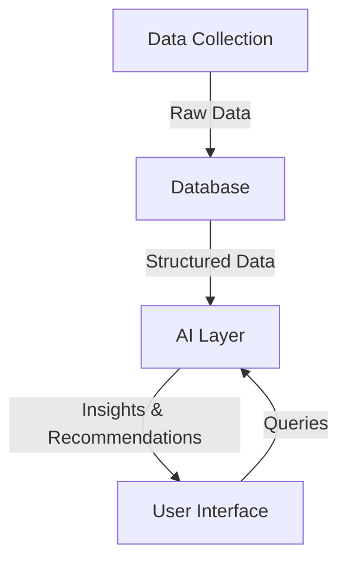

# Vibe AI 🌐

<div align="center">


> *Developed for the AGIHouseSF Hackathon* 🏆

</div>

---

## 📋 Overview

Vibe AI is an intelligent tool that stores and analyzes your social network information in a local database, enabling powerful queries and valuable insights about your network of contacts.

<div align="center">
  
</div>

### ✨ What Vibe AI can do:

<table>
  <tr>
    <td width="50%" align="center"><b>🔍 Intelligent Queries</b></td>
    <td width="50%" align="center"><b>🤝 Smart Recommendations</b></td>
  </tr>
  <tr>
    <td>
      <ul>
        <li>"Who in my network is investing in early-stage AI companies?"</li>
        <li>"Who in my network just left a company in the last few months?"</li>
        <li>"Find connections working at Google with expertise in machine learning"</li>
      </ul>
    </td>
    <td>
      <ul>
        <li>"I noticed your friend Jim mentioned they're leaving their space company to start something new, and your friend Helen invests in ambitious founders. You should introduce them: here are both emails."</li>
        <li>"Your colleague Alex is looking for a UX designer - your contact Taylor just updated their profile as available for work"</li>
      </ul>
    </td>
  </tr>
</table>

---

## 🏗️ Architecture

The project is built with a modular architecture designed for flexibility and extensibility:

<div align="center">



</div>

### 1. 📥 Data Collection
| Source | Data Type | Status |
|--------|-----------|--------|
| LinkedIn | Profiles, Messages | ⏳ In Progress |
| Messenger | Chat History | 🔜 Planned |
| Email | Contact Info | 🔜 Planned |
| Twitter | Public Posts | 🔜 Planned |

- **Goal**: Flexible ingestion interface to facilitate the creation of custom collectors

### 2. 💾 Database
- Stores information about people, public network data, and message history
- Powered by ChromaDB for efficient vector storage and retrieval
- Designed to work with various front-ends and ingestion patterns

### 3. 🧠 AI Layer
- Queries the database to generate valuable insights
- Uses advanced NLP to understand relationships and opportunities
- Continuously improves recommendations based on user feedback

### 4. 🖥️ Interface Options
- 🖱️ Local desktop application
- 🌐 Streamlit web interface
- ⚛️ React web application
- 📟 Command-line interface

---

## 🤝 How to Contribute

<div align="center">
  
</div>

The project is divided into three main areas that can function independently:

### 📊 Data Collection
To contribute a data collector:
1. Add a file or function to the `/scrapers` directory
2. Make sure to solve authentication and test to ensure reliable operation
3. The collector should be able to fetch useful information such as LinkedIn messages or Facebook profile data

### 🧩 AI Layer
To contribute query logic:
1. Add a file to the `/query` directory
2. Implement logic to read the database and generate results
3. Output can initially be in CLI

### 🎨 Frontend
To contribute an interface:
1. Create your own subdirectory in `/frontend`
   - Examples: 
     - `/frontend/python_cli` for CLI
     - `/frontend/nextapp` for JSX app
     - `/frontend/streamlit` for Streamlit app
2. Make sure not to interfere with other interfaces

---

## 🚀 Usage Guide

### ⚙️ Prerequisites
- Python 3.8+
- pip
- Git

### 🔧 Installation
```bash
# Clone the repository
git clone https://github.com/yourusername/vibe-ai.git
cd vibe-ai

# Install dependencies
pip install -r requirements.txt
```

### 🗃️ Database Configuration
| Action | Command | Description |
|--------|---------|-------------|
| **Create** | `python src/db_create_collection.py` and type `CREATE` | Sets up a new database instance |
| **Reset** | `python src/db_create_collection.py`, type `RESET`, then run again and type `CREATE` | Wipes and recreates the database |

### 🔄 Operations
| Action | Command | Description |
|--------|---------|-------------|
| **Add data** | `python src/main.py` | Imports data into the database |
| **Query data** | `python src/db_query_data.py` | Runs queries against the database |
| **Start server** | `python src/main.py` | Launches the ChromaDB server |

### 🛠️ Customization
Main functions to update:
- `chunk_long_document` (for different chunking algorithms)

### 📝 Notes
> ⚠️ Currently, we add each item in the same `main.py`. There's an issue with the Chroma client that gets reset and doesn't store in the same location.

---

<div align="center">

**[Documentation](https://github.com/yourusername/vibe-ai/wiki)** • 
**[Report Bug](https://github.com/yourusername/vibe-ai/issues)** • 
**[Request Feature](https://github.com/yourusername/vibe-ai/issues)**

</div> 